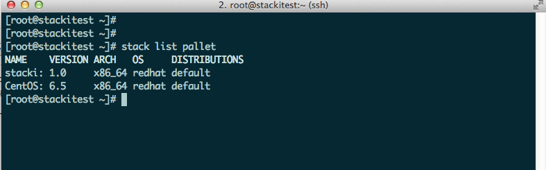

Adding a pallet expands the range of software available to backend machines. Newer versions of the OS (6.6 vs. 6.5), different distributions (e.g. RedHat instead of CentOS), updated OS packages, application packages with a yum repository etc. can all be added as a pallet. Once a pallet is added and enabled, a backend machine can have the desired RPMS installed with either yum or install/reinstall of the machine. 

### Adding a pallet - simple case:

Let's presume we have a stacki frontend with just two pallets, "stacki" and CentOS v6.5. The stacki pallet and an OS pallet are the minimal pallets that will make up any given distribution. (See "Adding Distributions" in the sidebar for further discussion of distributions.)

% List the pallets you currently have:

    stack list pallet

% Download the CentOS 6.6 DVD 1 ISO to the stack frontend. (This may take a bit....)

`# cd /export`  
`# wget http://mirror.umd.edu/centos/6.6/isos/x86_64/CentOS-6.6-x86_64-bin-DVD1.iso`

(You can also torrent this. If you want to add the DVD2 iso, download that too and do the following steps for that ISO as well, and you should probably check the MD5 sums after download.)

% Add the pallet

`# stack add pallet CentOS-6.6-x86_64-bin-DVD1.iso`

Like this:

% Enable new pallet, disable old pallet.

You don't want two OS pallets of different version being installed. So disable the old CentOS pallet, and enable the new one. (The version is listed in the output of `# stack list pallet`.) The '----' indicates a pallet that is is not enabled.

Disable the old version:  
`# stack disable pallet CentOS version=6.5`

Enable the new version:  
`# stack enable pallet CentOS version=6.6`

% Remake the distribution

A distribution contains packaging and configuration for installation of backend nodes. In this example, it's just the basic backend node configuration and now CentOS 6.6. To make all the RPMS that have been added in the CentOS pallet available to backend nodes for installation, the "default" distribution needs to be synced. 

`# stack create distribution`

Will remake the "default" distribution containing the kickstart configuration graph and the CentOS 6.6 RPMS and create a yum repository. This means during installation, backend nodes will be installed with 6.6 and all RPMS from 6.6 are available to the installed backend nodes with yum.

From here, reinstall nodes. You will not lose any data on the nodes unless you set the "nukedisks" or "nukecontrollers" attributes to "true," but the nodes will now have 6.6 as their base OS.

