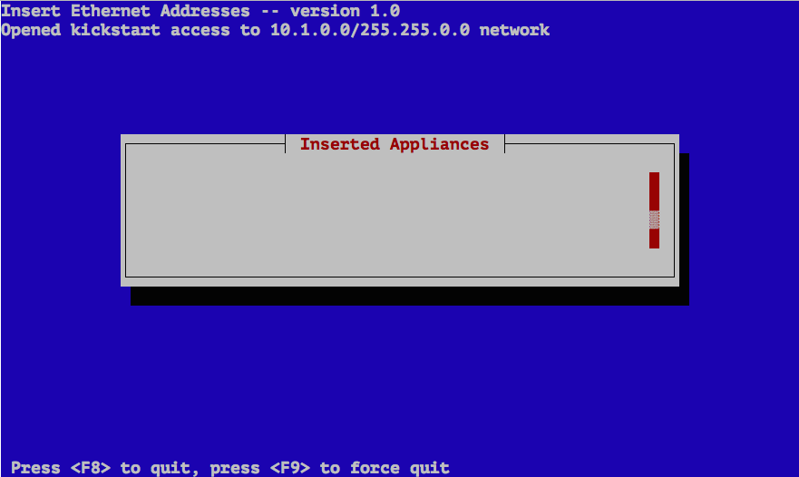
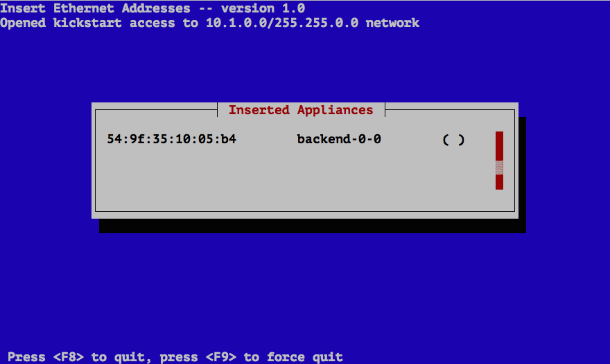
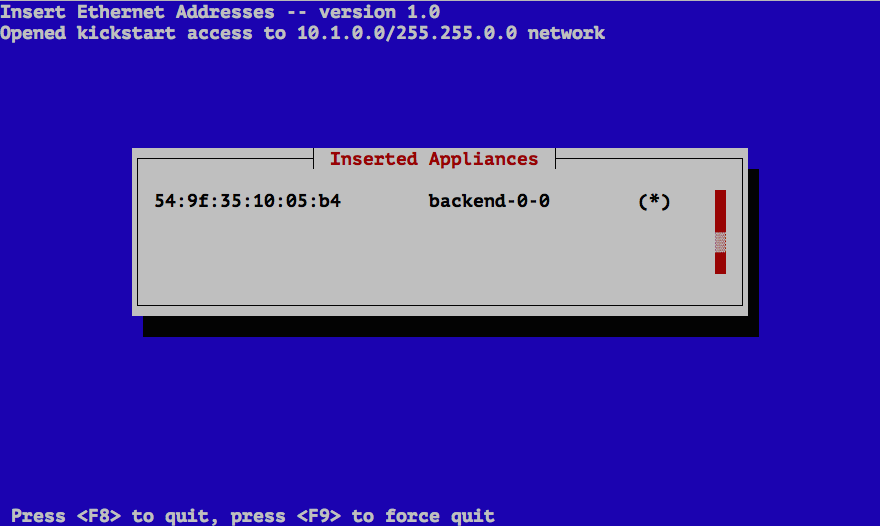

After the Frontend is up and running, Backend nodes can be installed.

## Requirements 

A Backend has the following hardware requirements. 

**Resource** | Minimum | Recommended
--- | --- | ---
**System Memory** | 1 GB | 8 GB
**Network Interfaces** | 1 (PXE-Capable) | 1 or more (PXE-Capable)
**Disk Capacity** | 40 GB | 100 GB

BIOS _boot order_

1. PXE (Network Boot)
2. CD/DVD Device (Optional - Only if device is present)
3. Hard Disk

## Discovery or SpreadSheet

To install a new Backend node stacki needs to add information about
the server (ip address, mac address, Appliance type, etc) to the
configuration database.
Choose between the [Discovery](#discovery) or [SpreadSheet](#spreadsheet) procedure to install
your new Backends.

### Discovery

In this mode the Frontend will listen on for any host requesting a
DHCP address and will respond with an address from its managed private
network.
The DHCP response will also be a PXE response that will tell the
server to re-install itself.
Does this sound scary, good it is, it is also a great method to
quickly and new Backends provided you are on an isolated private
network.
If this still sounds scary (it does to me) use the
[Spreadsheet](#spreadsheet) procedure.

To start disovery mode log into the Frontend as root as run the following:

```
# insert-ethers
```

This will bring up a screen that shows a list of Appliances available
for installation.

 

By default only the _Backend_ appliance will be listed.
Press _OK_ to continue and then turn on the machine you want
installed.



Once the Backend node sends out a PXE request the Frontend captures the
request and adds it to the stacki database.
If the server did not PXE boot go back to the
[Requirements](#requirements) and verify the BIOS boot order.



Once the Backend node downloads its Kickstart file, a '*' will next
the the hostname assigned to the new Backend node.



Continue to turn on any other machines you want installed and hi _F8_
when done.

### Spreadsheet

You can also specify all the information about a host before
installation in a CSV (Comma Separated Value) file.
The advantage of using CSV files, is that it gives fine-grained control over the
configuration of the cluster.
Create a new spreadsheet in Google Doc or Excel and export it as a
.csv for use with stacki.

The Host CSV file needs to have the following headers:

NAME | APPLIANCE | RACK | RANK | IP | MAC | INTERFACE | SUBNET 
-----|-----------|------|------|----|-----|-----------|--------

#### Sample Host CSV file

| NAME        | APPLIANCE | RACK | RANK | IP           | MAC               | INTERFACE | SUBNET  |  
|-------------|-----------|------|------|--------------|-------------------|-----------|---------| 
| backend-0-0 | backend   | 0    | 0    | 10.1.255.254 | 00:22:19:1c:0c:99 | eth0      | private |
| backend-0-1 | backend   | 0    | 1    | 10.1.255.255 | 00:22:19:1c:0c:98 | eth0      | private |
| backend-0-2 | backend   | 0    | 2    | 10.1.255.253 | 00:22:19:1c:0c:97 | eth0      | private |


Once the CSV file is created and copied to the Frontend it can be
loaded as root.
  
    # stack load hostfile file=hostfile.csv

You can verify the data was correctly loaded be listing the host
information from the configuration database.

```
# stack list host
HOST          RACK RANK CPUS APPLIANCE DISTRIBUTION RUNACTION INSTALLACTION
frontend-0-0: 0     0   1    frontend  default      os        install      
backend-0-0:  0     0   2    backend   default      os        install      
backend-0-1:  0     1   4    backend   default      os        install      
backend-0-2:  0     2   4    backend   default      os        install
```

By default number of CPUs on every Nackend node is set to 1.
This value will be updated automatically once a Backend node
is installed.

Every time a Backend node boot it will send a PXE request to the
Frontend.
The Frontend will tell the backend node to either boot its os or to
install.
The default boot action is always _os_ as you can see below.

```
# stack list host boot
HOST          ACTION
frontend-0-0: ------ 
backend-0-0:  os    
backend-0-1:  os    
backend-0-2:  os    
```

In order to install a Backend you will need to switch the boot action
to _install_ and then reboot.

```
# stack set host boot Backend action=install 
```

```
# stack list host boot
```
```
HOST          ACTION
frontend-0-0: ------ 
backend-0-0:  install
backend-0-1:  install
backend-0-2:  install
```

Now power up the backend machines.
The Backend machines will first boot into the stacki installer,
install the OS, set its boot action back to _os_ and reboot.

## Re-Installation

Because stacki manages the PXE boot of all of Backend nodes when it
comes time to re-install a machine you can just change the boot
action back to _install_, for example:

```
# stack set host boot backend-0-0 action=install
```

Then next time you boot the _backend-0-0_ it will rebuild the itself.
But a rebuild by default will only reformat the ```/var``` and ```/``` partitions.
This means all data in ```/export``` is maintained across re-installations.

If you want to completely reformat all data on the Backend during the
re-installing you need to set an Attribute for the given host before
you reboot the server.

```
# stack set host attr backend-0-0 attr=nukedisks value=true
```

After the Backend re-installs it will reset the value of the Attribute
to _false_ so the next time you re-install it will do the default and
only reformat the ```/var``` and ```/``` partitions.
We hate losing data also.
