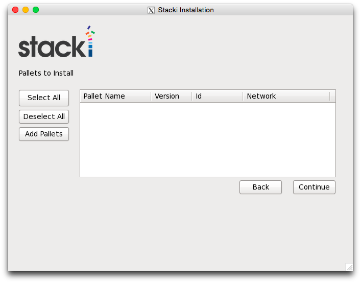
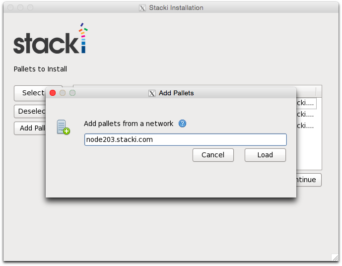
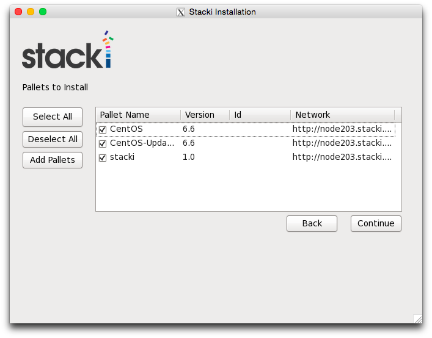
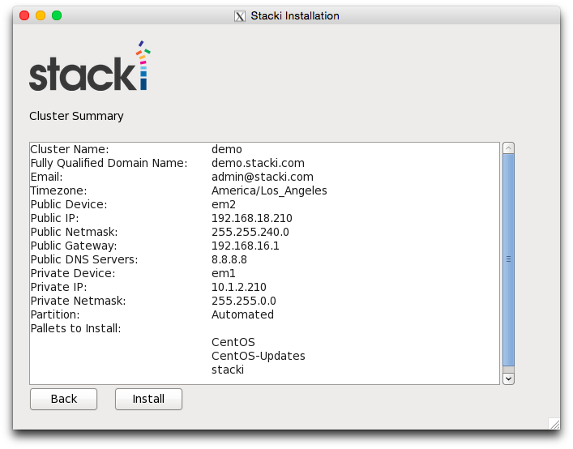

Frontend is our management node from which we will be installing other nodes in the cluster.

## Hardware Requirements for a frontend

##### Minimum Requirements
**Resource** | Capacity
-------- | --------
**System Memory** | 2 GB
**Network Interfaces** | 2
**Disk Capacity** | 64 GB

##### Recommended Hardware

Resource | Capacity
-------- | --------
**System Memory** | 16 GB or more
**Network Interfaces** | 2 or more
**Disk Capacity** | 200 GB

##### Additional Requirements

**BIOS Boot Order**

1. CD/DVD Device (Optional - Only if device is present)
2. Hard Disk

At least two Ethernet interfaces are required. The private interface e.g. eth0
 should be connected to the same Ethernet network as the
compute nodes. The public interface e.g. eth1 should be connected to the
external network (e.g., the internet or your organization’s intranet).

Insert the stacki DVD into your frontend and reset the
frontend machine. You will see the installation wizard described below.

## Installation Wizard

### Boot Media

### Cluster Information

The first screen will appear where you enter the _Name_ of the frontend, the _Fully Qualified Domain Name_ (i.e., name.yourdomain.com) of your frontend, _Email_ and _Timezone_ of the cluster.

### Public Network
The public cluster network configuration screen allows you to set up the
networking parameters for the ethernet network that connects the frontend to the
outside network (e.g., the internet). First choose your _Public Network Device_.
Then provide the _Public IP_, _Netmask_ and _Public Gateway_.
Next provide _DNS Servers_, if there is more than one DNS Server you can type a comma separated list (i.e., 8.8.8.8, 4.2.2.2, 8.8.4.4).

Note that after clicking on "Next", the wizard will immediately set these credentials.

### Private Network
The private network configuration screen allows you to set up the
networking parameters for the ethernet network that connects the frontend to the
backend nodes. Choose your _Private Network Device_.
Then enter the _Private IP_ and _Netmask_.

Note that after clicking on "Next", the wizard will immediately set these credentials.

### Password
This will be the root account password of the frontend.

### Choose Partition

The _Automatic_ mode, will repartition and reformat the first discovered hard drive that is connected to
the frontend. All other drives connected to the frontend will be left untouched.

| Partition Name | Size |
| --------------- | ---- |
|       /        | 16GB |
|       /var     | 16GB |
|       swap     |  1GB | 
| /export (symbolically linked to /state/partition1)|remainder of root disk|

When you use automatic partitioning, the installer will repartition
and reformat the first hard drive that the installer discovers.
All previous data on this drive will be erased. All other drives will be left untouched.
The drive discovery process uses the output of cat /proc/partitions to get the list of drives.
But, there are instances when a drive you don’t expect is the first discovered drive (we’ve seen this with
certain fibre channel connected drives). If you are unsure on how the drives will be discovered in a
multi-disk frontend, then use manual partitioning.

In _Manual_ mode, a partition setup screen will appear for you to setup after you complete this wizard.
If you select manual partitioning, you must specify at least 16 GBs for the
root partition and you must create a separate /export partition.

### Add Pallets

Choose the _Pallets_ you want to install.
If booting from a DVD, pallets should automatically load onto the list for you to choose.

In this case, we are not using a DVD and installing from a network.

You can also load more pallets through a network by clicking on "Add Pallets" and providing the URL to the pallets server.
This is another method to load pallets.

The "Id" column denotes pallets loaded from a DVD and the "Network" column denotes pallets from a network.
Select all pallets you want to install.

### Review

Review your credentials and click "Install" to proceed.
The frontend will format its filesystems and subsequently copy the
pallets from the network / DVD onto the frontend's hard disk.
Packages will be installed after all pallets are copied.
Finally, the boot loader will be installed and post configuration
scripts will be run in the background.
When they complete, the frontend will reboot.

Your stacki frontend is now ready to roll!
