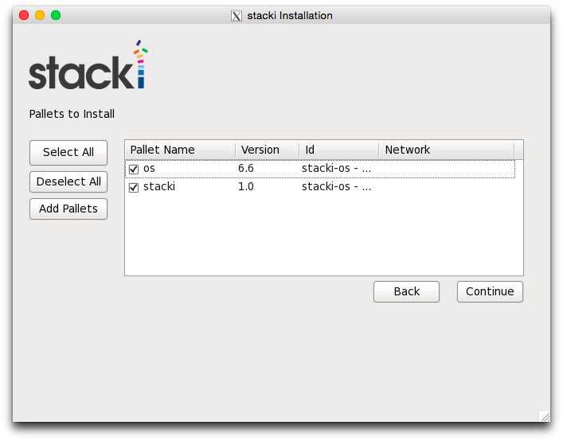

Stacki requires a single dedicated server that will host all
the software and services used to build out other servers. We
call this server the **Frontend**, and the first step to running
Stacki is to build a Frontend.

The process is fairly simple and looks similar to a standard Linux
build with the addition of a wizard to capture site-specific
networking information.

## Requirements 

A Frontend has the following hardware requirements.

**Resource** | Minimum | Recommended
--- | --- | ---
**System Memory** | 2 GB | 16 GB
**Network Interfaces** | 2 | 2
**Disk Capacity** | 64 GB | 200GB
**CD/DVD Device | 1 | 1

##### BIOS _boot order_

1. CD/DVD Device
2. Hard Disk

## Boot Media 

Insert the stacki DVD into your Frontend and boot from the media.
You will see the following screen, just hit enter (or wait) and proceed to the installation wizard.

 

## Installation Wizard

### Cluster Information

The first screen will appear where you enter

1. _Name_ of the Cluster - for example "Demo"
2. _Fully Qualified Domain Name_ of the frontend (i.e., name.yourdomain.com)
3. _Email_ - Administrator Email
4. _Timezone_ of the cluster.

### Public Network
The public cluster network configuration screen allows you to set up the
networking parameters for the ethernet network that connects the frontend to the
outside network (e.g., the internet).

1. Select _Network Interface_ connected to the **Public network**.
2. _IP Address_ of Public interface
3. _Netmask_
4. _IP Address of the Public Gateway / Router_.
5. _DNS Servers_ - More than one DNS Server can be
   entered as a comma-separated list (i.e., 8.8.8.8, 4.2.2.2, 8.8.4.4).

On clicking "Next", the wizard configures the network interface
to the provided information.

### Private Network
The private network configuration screen configures the
networking parameters for the ethernet network that
connects the frontend to the backend nodes.

1. Select _Network Interface_ connected to the **Private(Management) Network**.
2. _IP Address_ of the Private Interface
3. _Netmask_

On clicking "Next", the wizard configures the network interface
to the provided information.

### Password
Enter the password for the **root** account on the frontend.

### Choose Partition

If _Automatic_ mode is selected, the installer will
repartition and reformat the first discovered hard drive
that is connected to the frontend. All other drives
connected to the frontend will be left untouched.

| Partition Name | Size |
| --------------- | ---- |
|       /        | 16GB |
|       /var     | 16GB |
|       swap     |  1GB | 
| /export (symbolically linked to /state/partition1)|remainder of root disk|

When using automatic partitioning, the installer repartitions
and reformats the first hard drive (e.g. _sda_) that the installer
discovers. All previous data on this drive will be erased.
All other drives will be left untouched. If you are unsure about how
the drives will be discovered in a multi-disk frontend,
select *Manual Partitioning*.

In _Manual_ mode, the installer brings up a partition setup
screen after the wizard exits. In this mode, specify at least 16 GB
for the root partition and a separate **/export** partition.

### Add Pallets

Choose the _Pallets_ you want to install.
Booting from a DVD, pallets should automatically load onto the list for you to choose.

The "Id" column denotes pallets loaded from a DVD and the "Network" column denotes pallets from a network (not being used).

Select "stacki" and "os" pallets to install.

### Review

Review the installation parameters and click "Install" to proceed.
The frontend will format its filesystems and subsequently copy the
pallets from the network / DVD onto the frontend's hard disk.
Packages will be installed after all pallets are copied.
Finally, the boot loader will be installed and post configuration
scripts will be run in the background.
When they complete, the frontend will reboot.

Your stacki frontend is now ready to roll!
