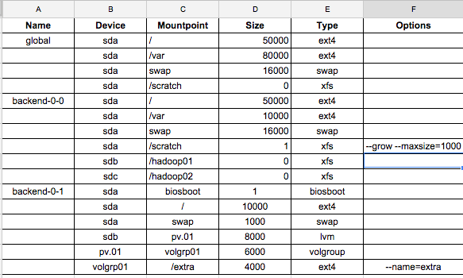
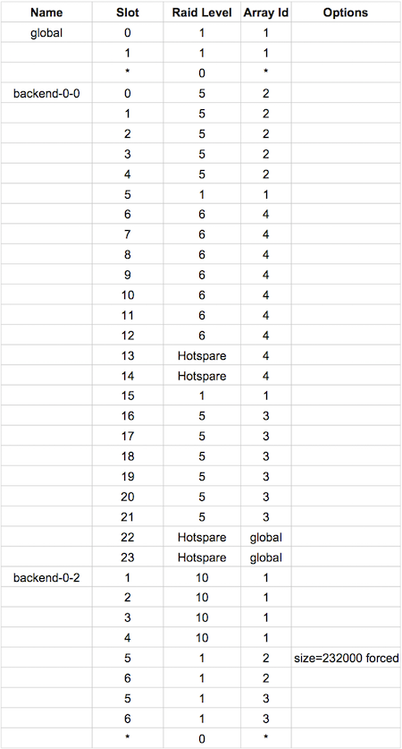

Stacki manages storage at both the [Partition](#partition) level and the hardware
[RAID Controller](#raid-controller) level.

## Partition

### Spreadsheet
 
The configuration of disk partitions can be specified in a
spreadsheet with the following columns:
  
1. **Name**. A host name, appliance type or global. 
1. **Device**. The Linux disk device name (e.g., ``sda``, ``sdb``). 
1. **Mountpoint**. Where the partition should be mounted on the file system. 
1. **Size**. The size of the partition in megabytes. 
1. **Type**. How the partition should be formatted (e.g., xfs, swap).
1. **Options**. Free form string of options that can be used to create a partition.
 
A 
[sample spreadsheet](https://docs.google.com/spreadsheets/d/1nukh3bwcgwhxXn1czhDawog_-srlXgCy7arh2m71-so/edit?usp=sharing) 
is shown below. 

 
 
The _Name_ column can contain a specific host name (e.g., _backend-0-0_), an
Appliance type (e.g., _backend_) or it can be set to _global_.  
 
In the sample spreadsheet, we see the default configuration (_global_) is to
only configure the partitions for the first disk (``sda``).
The root partition ``/`` is an ext4 partition and it is 50 GB.
The ``/var`` partition is an ext4 partition and it is 80 GB.
The ``swap`` partition is 16 GB.
Lastly, ``/scratch`` is an xfs partition and it will be the remainder of ``sda``.
 
The configuration for _backend-0-0_ has a similar configuration for ``sda`` as the _global_ configuration except for the ``/scratch`` partition. The maximum size of ``/scratch`` partition is set to 1 GB via the Options column.
Additionally, ``sdb`` and ``sdc`` will be configured for _backend-0-0_ as single partitions that span the entire disk.

### LVM

Stacki 2.0 supports specifying LVM configuration via a spreadsheet. **lvm**, **volgroup** are keywords that indicate that the partition needs to be setup via LVM. In the configuration for ``backend-0-1``,
``pv.01`` is configured as a physical volume on ``sdb`` with size as 8GB. 
``volgrp01`` is a volgroup comprising of ``pv.01``. ``/extra`` is mounted as an lvm partition on volgroup ``volgrp01``.

When you are finished editing your spreadsheet, save it as a CSV file, then copy the CSV file to your frontend.
Then, load the CSV file into the database on the frontend by executing:

``` 
# stack load storage partition file=partition.csv
```
 
You can view your storage partition configuration by executing:

```
# stack list storage partition
```

### The _nukedisks_ Attribute
 
A host's disk partitions will only be reconfigured if the _nukedisks_ attribute is set to _true_. On first install, all installing backend disks automatically have _nukedisks_ set to _false_. If you've added backend nodes via spreadsheet, you must set _nukedisks_ to _true_ as in the example below, before installing.

As an example, to set the _nukedisks_ attribute for host _backend-0-0_, execute:

``` 
# stack set host attr backend-0-0 attr=nukedisks value=true
```
 
Then, the next time _backend-0-0_ is installed, it will remove all partitions for all disks, then repartition the disks as you specified in your spreadsheet.
 
While a host is installing, after it partitions its disks, it will send a message to the frontend to instruct it to set the  _nukedisks_ attribute back to _false_.
This ensures that the disks will not be reconfigured on the next installation.


## RAID Controller

Stacki can automatically configure two types of hardware RAID controllers:

1. LSI MegaRAID
2. HP Smart Array

### Spreadsheet

The configuration of disk controllers can be specified in a
spreadsheet with the following columns:
  
1. **Name**. A host name, appliance type or global.  
1. **Slot**. The slot of a specific disk in the array.  
1. **Raid Level**. The RAID level for the disks. This can be 0, 1, 10, 5, 6, 50, 60.  
1. **Array Id**. The order in which the RAID groups will be constructed. 
1. **Options**. Any additional options to be passed on to the ```storcli``` or ```hpssacli``` command.

A
[sample spreadsheet](https://docs.google.com/spreadsheets/d/1o2ZxQUN5ZLAnOxs-A8wiWIzJ0TVLU3uQ2zKGpIs4CU0/pubhtml)
is shown below.

 

The _Name_ column can contain a specific host name (e.g., _backend-hp-0-2_), an
appliance type (e.g., _backend_) or it can be set to _global_.

In the sample spreadsheet, we see the default configuration (_global_) is to
configure the disks in slot 0 and 1 as a RAID 1 mirror and make them the
first logical disk (the Linux kernel will see this as ```sda```). 
The remaining disks (the disks in slots 2 and up) will be configured as individual RAID 0 disks. This is analogous to setting up the controller in JBOD mode. 
We specify this with the wildcard symbol "*" for the _Slot_ and _Array Id_ cells.
Wildcards are useful when your backend hosts have different number of disks drives.

The next configuration is for all _backend_ hosts.
The first logical disk (```sda```) will be a RAID 1 and it will be constructed with the disk in slot 5 and the disk in slot 15.
The second logical disk (```sdb```) will be a RAID 5 composed of the disks in slots 0 through 4.
The third logical disk (```sdc```) will be a RAID 5 composed of the disks in slots 16 through 21.
The fourth logical disk (```sdd```) will be a RAID 6 composed of the disks in slots 6 through 12 and the disks in slots 13 and 14 will be hot spares associated with only this array.
The disks in slots 22 and 23 are designated as hot spares that can be used as replacements for any failed drive in any array.

The third configuration is for the host named _backend-hp-0-2_.
The first logical disk (```sda```) is a RAID 10 set composed of disks 1 through 4.
The second logical disk(```sdb```) is a RAID 1 set composed of disks 5 and 6 with a size of 232 GB.
The third logical disk(```sdc```) is a RAID 1 set, also composed of disks 5 and 6, using up the remainder of the disks.
The remaining disks (the disks in slots 7 and up) will be configured as individual RAID 0 disks.

The last configuration (for host _backend-hp-0-2_) is considered advanced configuration. This is due to slots 5 and 6 being listed multiple times in the spreadsheet.
 
When you are finished editing your spreadsheet, save it as a CSV file, then copy the CSV file to your frontend.
Then, load the CSV file into the database on the frontend by executing
```
# stack load storage controller file=controller.csv
```

If the controller spreadsheet contains advanced configuration (as demonstrated by the configuration for _backend-hp-0-2_), the ```force=y``` argument will need to be appended to the above command
```
# stack load storage controller file=controller.csv force=y
```

You can view your storage controller configuration by executing:
```
# stack list storage controller
```

### The _nukecontroller_ attribute

A host's hardware RAID controller will only be reconfigured if the _nukecontroller_ attribute is set to _true_.
As an example, to set the _nukecontroller_ attribute for host _backend-0-0_, execute:

```
# stack set host attr backend-0-0 attr=nukecontroller value=true
```

Then, the next time _backend-0-0_ is installed, it will remove the current hardware RAID controller configuration, then configure it as you specified in your spreadsheet.

Like the _nukedisks_ attribute, _nukecontroller_ is set to _false_ on the initial installation of a backend node. If the RAID controller has been configured by hand with a keyboard and monitor, that configuration is safe unless the _nukecontroller_ attribute is set to _true_.

After the host has completed installation, _nukecontroller_ attribute for that host is reset to _false_.

This ensures that the controller will not be reconfigured on the next installation.